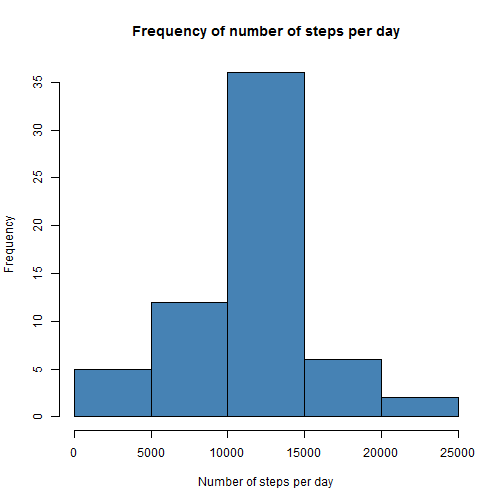

---
# "Reproducible Research: Peer Assessment 1"


## Loading and preprocessing the data

```r
setwd("C:/Users/Jingmin/Documents")
getwd()
```

```
## [1] "C:/Users/Jingmin/Documents"
```

```r
activity <- read.csv("activity.csv",header=TRUE)
```

## What is mean total number of steps taken per day?
### Make a histogram of frequenct of total number of steps taken each day


```r
head(activity)
```

```
##   steps       date interval
## 1    NA 2012-10-01        0
## 2    NA 2012-10-01        5
## 3    NA 2012-10-01       10
## 4    NA 2012-10-01       15
## 5    NA 2012-10-01       20
## 6    NA 2012-10-01       25
```

```r
dailyTotalSteps <- tapply(activity$steps,activity$date,sum)
hist(dailyTotalSteps,col="steelblue",breaks=6,xlab="Number of Steps Per day",main="Frequency of Number of Steps Per day")
```

 
### Calculate the mean and median of total number of steps taken each day

* calculate mean of total number of steps taken per day


```r
mean(dailyTotalSteps,na.rm=T)
```

```
## [1] 10766.19
```

* calculate median of total number of steps taken per day


```r
median(dailyTotalSteps,na.rm=T)
```

```
## [1] 10765
```

## What is the average daily activity pattern?

```r
head(activity)
```

```
##   steps       date interval
## 1    NA 2012-10-01        0
## 2    NA 2012-10-01        5
## 3    NA 2012-10-01       10
## 4    NA 2012-10-01       15
## 5    NA 2012-10-01       20
## 6    NA 2012-10-01       25
```

```r
stepsPerInterval <- tapply(activity$steps,activity$interval,mean,na.rm=T)
 plot(stepsPerInterval,type="l",main="Steps Vs. Interval (daily average)",ylab="# of steps")
```

 
### Interval with the maximum number of steps:

* 104 interval (835) has the maximum number of steps


```r
which(stepsPerInterval == max(stepsPerInterval))
```

```
## 835 
## 104
```


## Imputing missing values
####  Calculate and report the total number of missing values in the dataset (i.e. the total number of rows with NAs)

```r
sum(as.numeric(is.na(activity$steps)))
```

```
## [1] 2304
```

- Devise a strategy for filling in all of the missing values in the dataset. The strategy does not need to be sophisticated. For example, you could use the mean/median for that day, or the mean for that 5-minute interval, etc.

- Create a new dataset that is equal to the original dataset but with the missing data filled in.

- Make a histogram of the total number of steps taken each day and Calculate and report the mean and median total number of steps taken per day. Do these values differ from the estimates from the first part of the assignment? What is the impact of imputing missing data on the estimates of the total daily number of steps?

```r
# transform steps data per interval into vector and replicate it for 61 times
# for non missing values set tem_stepsMeanPerInterval as 1

tmp_stepsMeanPerInterval <- as.vector(stepsPerInterval)
tmp_stepsMeanPerInterval <- rep(tmp_stepsMeanPerInterval, 61)
tmp_stepsMeanPerInterval[!is.na(activity$steps)] = 1

# Get the steps data as a vector

tmp_dataTest <- as.vector(activity$steps)

# Set it to one where data is missing

tmp_dataTest[is.na(tmp_dataTest)] = 1

data_NoMissing <- activity
data_NoMissing$steps <- tmp_stepsMeanPerInterval * tmp_dataTest
```


```r
stepsTotalPerDay_NoMissing <- tapply(data_NoMissing$steps, data_NoMissing$date, 
    sum)
hist(stepsTotalPerDay_NoMissing, breaks = 6, main = "Frequency of number of steps per day", xlab = "Number of steps per day", ylab = "Frequency", col = "steel blue")
```

 


## Are there differences in activity patterns between weekdays and weekends?
#### Create a new factor variable in the dataset with two levels - "weekday" and "weekend" indicating whether a given date is a weekday or weekend day.

#### Make a panel plot containing a time series plot (i.e. type = "l") of the 5-minute interval (x-axis) and the average number of steps taken, averaged across all weekday days or weekend days (y-axis). See the README file in the GitHub repository to see an example of what this plot should look like using simulated data.

```r
# Create a factor variable with two levels (weekday, weekend-day)
tmpLT <- as.POSIXlt(activity$date, format = "%Y-%m-%d")
tmpWeekDays <- tmpLT$wday
tmpWeekDays[tmpWeekDays == 0] = 0
tmpWeekDays[tmpWeekDays == 6] = 0
tmpWeekDays[tmpWeekDays != 0] = 1
tmpWeekDaysFactor <- factor(tmpWeekDays, levels = c(0, 1))
# Add the factor variable to the data
activity$WD <- tmpWeekDaysFactor
# Calculate the mean
stepsMeanPerWeekday <- tapply(activity$steps, list(activity$interval, activity$WD), mean,na.rm = T)
par(mfrow = c(2, 1))
# Display the 2 plots
with(activity, {
    par(mai = c(0, 1, 1, 0))
    plot(stepsMeanPerWeekday[, 1], type = "l", main = ("Steps vs. Interval"), 
        xaxt = "n", ylab = "Week ends")
    title = ("# of Steps v.s. Interval")
    par(mai = c(1, 1, 0, 0))
    plot(stepsMeanPerWeekday[, 2], type = "l", xlab = "Interval", ylab = "Week days")

})
```

 
